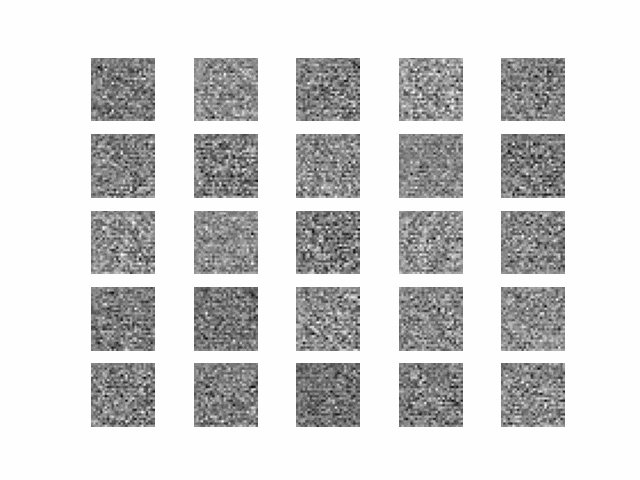

GAN 的核心概念是由兩個神經網絡，生成器（Generator）和鑑別器（Discriminator），透過對抗過程進行訓練。以下是這個過程的數學描述：

### 基本組件

1. **生成器 (G)**: 試圖創造出看起來像真實數據的數據。它接受一個隨機噪聲向量 $z$（從某個潛在空間分布中抽樣得到），並生成數據 $G(z)$。

2. **鑑別器 (D)**: 試圖區分真實數據和生成器創造的假數據。對於給定的輸入數據 $x$，鑑別器輸出一個表示數據為真實數據的概率 $D(x)$。

### 目標函數

GAN 的訓練過程可以看作是一個迷你-最大博弈遊戲（minimax game），其中生成器和鑑別器各自嘗試最小化和最大化以下目標函數：


$$
\min_{G} \max_{D} V(D, G) = \mathbb{E}_ {x \sim p_{\text{data}}(x)}[\log D(x)] + \mathbb{E}_ {z \sim p_{z}(z)}[\log (1 - D(G(z)))]
$$

這裡：
- $\mathbb{E}_ {x \sim p_{\text{data}}(x)}[\log D(x)] $ 是鑑別器評估真實數據的期望對數概率。鑑別器希望

這部分的值最大化，意味著對於真實數據 $x$，鑑別器 $D(x)$ 應該接近 1（即判斷為真實的概率高）。

- $\mathbb{E}_ {z \sim p_{z}(z)}[\log (1 - D(G(z)))]$ 是鑑別器評估由生成器創造的假數據的期望對數概率。在這裡，生成器 $G$ 產生數據 $G(z)$，而鑑別器 $D$ 試圖將其判斷為假（即 $D(G(z))$ 接近 0）。生成器的目標是讓這部分的值最小化，意味著生成的數據足夠好以至於鑑別器將它們誤判為真實數據。

### 訓練過程

在實際訓練過程中，我們會交替進行以下步驟：

1. **訓練鑑別器 (D)**: 固定生成器 $G$，更新鑑別器 $D$ 以最大化 $\mathbb{E}_ {x \sim p_{\text{data}}(x)}[\log D(x)] + \mathbb{E}_ {z \sim p_{z}(z)}[\log (1 - D(G(z)))]$。這通常通過梯度上升法實現。

2. **訓練生成器 (G)**: 固定鑑別器 $D$，更新生成器 $G$ 以最小化 $\mathbb{E}_ {z \sim p_{z}(z)}[\log (1 - D(G(z)))]$。這通常通過梯度下降法實現。

### 收斂

理想的情況是，隨著訓練的進行，生成器會越來越擅長創造看起來真實的數據，而鑑別器則會越來越擅長區分真假數據，直到達到一個均衡點。在這個點上，鑑別器不能再準確地區分真假數據，即對於所有 $x$， $D(x) = 0.5$。

總的來說，GAN 透過一個對抗性的訓練過程，使得生成器能夠產生越來越逼真的數據，而鑑別器則試圖以最佳的策略來

區分真假數據。這個過程促使兩者不斷進化和改進，最終達到一種動態平衡，這種平衡狀態下的生成器能夠產生非常接近真實數據的輸出。


```python
from keras.datasets import mnist
from keras.layers import Dense, Flatten, Reshape, LeakyReLU, Input
from keras.models import Sequential, Model
from keras.optimizers import Adam
import numpy as np
import matplotlib.pyplot as plt
from keras.layers import Conv2DTranspose, BatchNormalization
from keras.layers import Conv2D, Dropout, Flatten

# 設定
img_rows = 28
img_cols = 28
channels = 1
img_shape = (img_rows, img_cols, channels)
latent_dim = 100

# 建立生成器

def build_generator():
    model = Sequential()

    # 將輸入映射到一個 7x7x128 的特徵圖
    model.add(Dense(7 * 7 * 128, input_dim=latent_dim))
    model.add(LeakyReLU(alpha=0.2))
    model.add(Reshape((7, 7, 128)))
    model.add(BatchNormalization())

    # 上採樣到 14x14
    model.add(Conv2DTranspose(128, kernel_size=3, strides=2, padding='same'))
    model.add(LeakyReLU(alpha=0.2))
    model.add(BatchNormalization())

    # 上採樣到 28x28 (MNIST 圖像大小)
    model.add(Conv2DTranspose(64, kernel_size=3, strides=2, padding='same'))
    model.add(LeakyReLU(alpha=0.2))
    model.add(BatchNormalization())

    model.add(Conv2DTranspose(1, kernel_size=3, strides=1, padding='same', activation='tanh'))

    return model


def build_discriminator():
    model = Sequential()

    model.add(Conv2D(64, kernel_size=3, strides=2, padding='same', input_shape=img_shape))
    model.add(LeakyReLU(alpha=0.2))
    model.add(Dropout(0.3))

    model.add(Conv2D(128, kernel_size=3, strides=2, padding='same'))
    model.add(LeakyReLU(alpha=0.2))
    model.add(Dropout(0.3))

    model.add(Flatten())
    model.add(Dense(1, activation='sigmoid'))

    return model


# 編譯鑑別器
discriminator = build_discriminator()
discriminator.compile(loss='binary_crossentropy',
                      optimizer=Adam(0.0002, 0.5),
                      metrics=['accuracy'])

# 編譯生成器
generator = build_generator()
z = Input(shape=(latent_dim,))
img = generator(z)

# 唯有當生成器和鑑別器合併時，才訓練生成器
discriminator.trainable = False
valid = discriminator(img)

# 合併生成器和鑑別器
combined = Model(z, valid)
combined.compile(loss='binary_crossentropy', optimizer=Adam(0.0002, 0.5))

# 訓練
def train(epochs, batch_size=128, save_interval=50):

    # 載入 MNIST 數據集
    (X_train, _), (_, _) = mnist.load_data()

    # 正規化
    X_train = X_train / 127.5 - 1.
    X_train = np.expand_dims(X_train, axis=3)

    valid = np.ones((batch_size, 1))
    fake = np.zeros((batch_size, 1))

    for epoch in range(epochs):

        # ---------------------
        #  訓練鑑別器
        # ---------------------

        idx = np.random.randint(0, X_train.shape[0], batch_size)
        imgs = X_train[idx]

        noise = np.random.normal(0, 1, (batch_size, latent_dim))
        gen_imgs = generator.predict(noise)

        d_loss_real = discriminator.train_on_batch(imgs, valid)
        d_loss_fake = discriminator.train_on_batch(gen_imgs, fake)
        d_loss = 0.5 * np.add(d_loss_real, d_loss_fake)

        # ---------------------
        #  訓練生成器
        # ---------------------

        noise = np.random.normal(0, 1, (batch_size, latent_dim))
        g_loss = combined.train_on_batch(noise, valid)

        # 打印進度
        print ("%d [鑑別器損失: %f, 準確率.: %.2f%%] [生成器損失: %f]" % (epoch, d_loss[0], 100*d_loss[1], g_loss))

        # 如果到了保存的間隔，就保存生成的圖像樣本
        if epoch % save_interval == 0:
            save_imgs(epoch)

# 保存圖像
def save_imgs(epoch):
    r, c = 5, 5
    noise = np.random.normal(0, 1, (r * c, latent_dim))
    gen_imgs = generator.predict(noise)

    # 正規化圖像
    gen_imgs = 0.5 * gen_imgs + 0.5

    fig, axs = plt.subplots(r, c)
    cnt = 0
    for i in range(r):
        for j in range(c):
            axs[i,j].imshow(gen_imgs[cnt, :,:,0], cmap='gray')
            axs[i,j].axis('off')
            cnt += 1
    fig.savefig("mnist_%d.png" % epoch)
    plt.close()

# 訓練生成器和鑑別器
train(epochs=200000, batch_size=32, save_interval=5000)

```


```python
import imageio
import os

def create_gif(input_folder, output_file, duration):
    images = []
    for file_name in sorted(os.listdir(input_folder)):
        if file_name.endswith('.png'):
            file_path = os.path.join(input_folder, file_name)
            images.append(imageio.imread(file_path))
    imageio.mimsave(output_file, images, duration=duration)

# 使用示例
input_folder = r'C:\Users\B20770\Desktop\Lin\深度學習\GAN'  # 將此路徑替換為您圖像的存儲位置
output_file = 'output.gif'  # GIF的輸出文件名
duration = 0.5  # 每幀之間的持續時間，以秒為單位

create_gif(input_folder, output_file, duration)
```




```python

```
